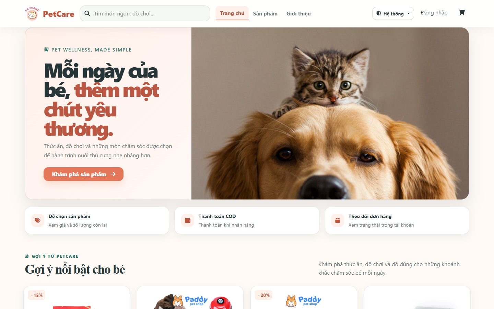
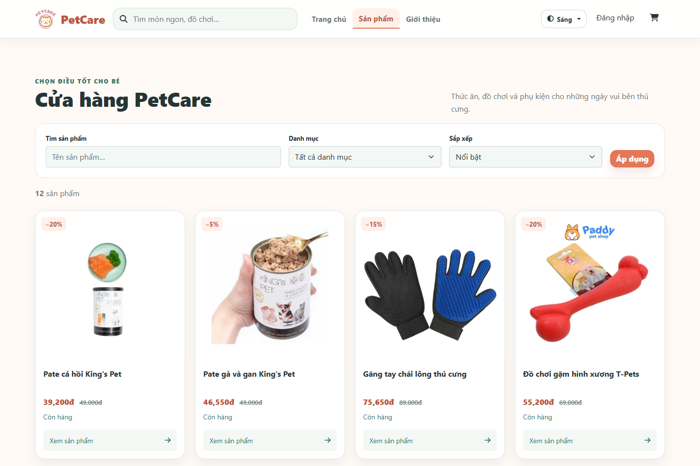
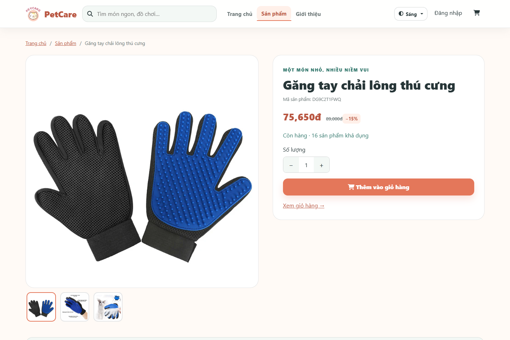
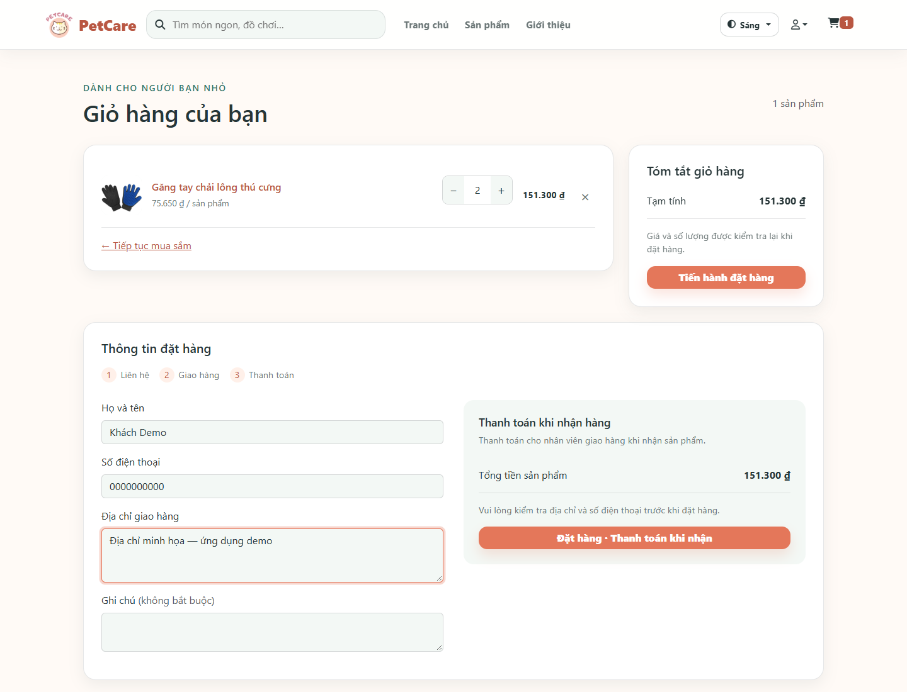
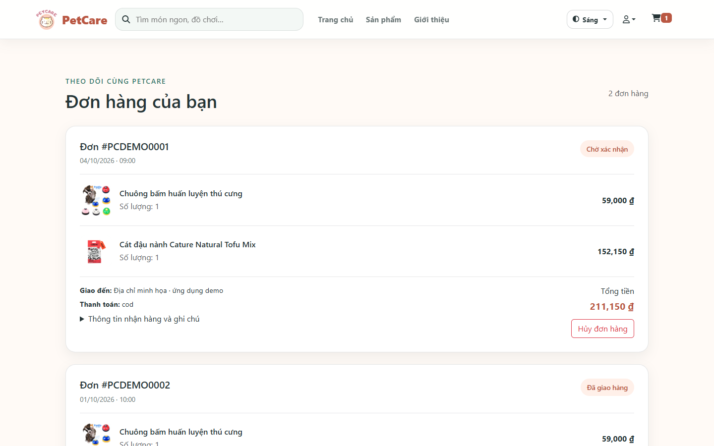
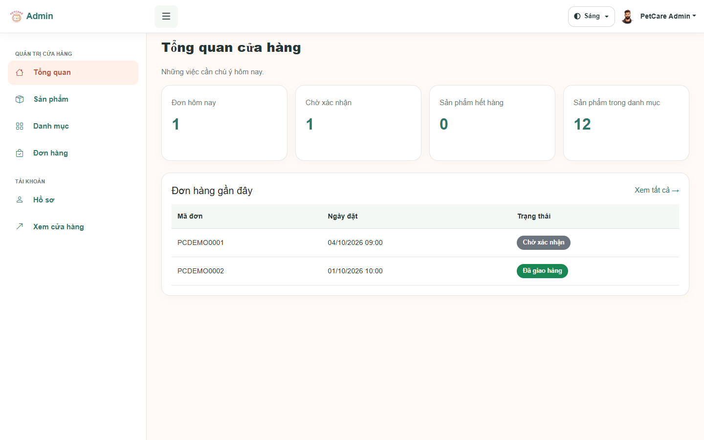
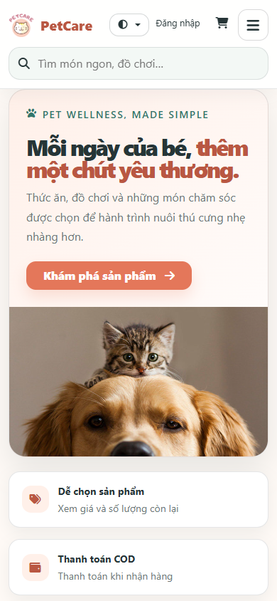

# PetCare

A friendly Laravel pet-care storefront and portfolio demo. Browse products, place a cash-on-delivery order, and manage the catalogue from a protected admin area, all with Blade, responsive layouts, and PetCare's coral and sage identity.

<p align="center">
  
</p>

## Overview

PetCare demonstrates a complete customer-to-admin commerce flow without requiring a payment provider or external infrastructure. The interface is primarily Vietnamese; prices use Vietnamese dong (VND). Bundled sample products and opt-in demo accounts make it easy to explore locally.

## Highlights

- Public catalogue with URL-backed search, category filters, sorting, and pagination
- Debounced navbar search, product galleries, genuine stock information, and editable cart
- Server-priced COD checkout, transactional stock updates, discount snapshots, and safe cancellation
- Passport authentication, email OTP registration/recovery, profile editing, and password changes
- Role-protected admin product/category CRUD, order handling, profile settings, and real overview counts
- Light, dark, and system themes; accessible controls and responsive customer/admin layouts
- Focused feature tests protecting search, commerce, authentication, and authorization

## Screenshots

<p align="center">
  
  
</p>
<p align="center">
  
  
</p>
<p align="center">
  
  
</p>

Also available: [dark-theme catalogue](docs/screenshots/dark-mode.png).

## Tech Stack

PHP 8.2+, Laravel 11, Blade, Bootstrap 5.3, custom CSS, Vite, and focused JavaScript modules with some jQuery. Laravel Passport provides API authentication. SQLite is the easy local default; standard MySQL and PostgreSQL connection configuration is available. Mail and optional queues use Laravel's built-in infrastructure.

## Getting Started

Requires PHP with Laravel extensions and SQLite support, Composer, and Node.js 22+ (24 recommended).

```bash
git clone https://github.com/Sanguin3G/PetCare.git
cd PetCare
composer install
cp .env.example .env           # Windows PowerShell: Copy-Item .env.example .env
php artisan key:generate
php -r "file_exists('database/database.sqlite') || touch('database/database.sqlite');"
php artisan migrate --seed
php artisan passport:keys
php artisan passport:client --personal --name=PetCare --no-interaction
php artisan storage:link
npm ci
npm run build
php artisan serve
```

Open `http://localhost:8000`. Passport signing keys and a personal access client are required for login. Existing installations should run `php artisan migrate` for the additive discount snapshot migration.

For a disposable demo database, optionally add sample accounts and orders:

```bash
php artisan db:seed --class=DemoSeeder
```

| Area | Email | Password |
| --- | --- | --- |
| Customer | `customer@petcare.test` | `PetCareDemo123!` |
| Admin (`/admin/login`) | `admin@petcare.test` | `PetCareDemo123!` |

These are deliberately public demo credentials. Do not seed them on a public installation. The regular seeder creates only the catalogue; the explicit demo seeder also populates sample order history.

## Configuration

`.env.example` contains safe defaults: SQLite, file sessions/cache, synchronous jobs, log mail, and log broadcasting. No Redis or worker is needed to run the demo. Keep `.env`, `APP_KEY`, Passport keys, and database credentials private.

- **Database:** use `DB_CONNECTION=mysql` or `pgsql` with `DB_HOST`, `DB_PORT`, `DB_DATABASE`, `DB_USERNAME`, and `DB_PASSWORD`. SQLite is convenient locally; hosting normally needs a persistent database or managed relational service.
- **Mail:** the log transport writes OTP messages to `storage/logs/laravel.log` locally. To deliver mail, set `MAIL_MAILER=smtp`, `MAIL_HOST`, `MAIL_PORT`, `MAIL_USERNAME`, `MAIL_PASSWORD`, and `MAIL_FROM_ADDRESS`; use `MAIL_SCHEME=smtps` for implicit TLS when required by your provider. Container log mail goes to stderr.
- **Queues:** `QUEUE_CONNECTION=sync` runs mail immediately. To use database-backed asynchronous jobs, set `QUEUE_CONNECTION=database` and run `php artisan queue:work`.
- **Passport:** signing keys live in `storage`; environment-based `PASSPORT_PRIVATE_KEY` / `PASSPORT_PUBLIC_KEY` are also supported. Provision the personal client once per database.

## Deployment Readiness

A single multi-stage Docker image builds Composer dependencies and Vite assets, then serves Laravel through Apache/PHP on port 8080 as an unprivileged user. No database reset or seeding runs at startup.

Create `.env` from the example. Set a stable `APP_KEY` (from `php artisan key:generate --show`), `APP_ENV=production`, `APP_DEBUG=false`, and `APP_URL=http://localhost:8000`. For container SQLite, leave `DB_DATABASE` unset to use the image's storage path.

```bash
docker build -t petcare .
docker run -d --name petcare --env-file .env -p 8000:8080 \
  -v petcare-data:/var/www/html/storage \
  -v petcare-uploads:/var/www/html/public/assets/img-add-pro petcare
docker exec petcare php artisan migrate --seed --force
docker exec petcare php artisan passport:keys --no-interaction
docker exec petcare php artisan passport:client --personal --name=PetCare --no-interaction
```

Use one line for `docker run` in PowerShell, or replace the shell continuation characters with backticks. Optionally seed sample accounts with `docker exec petcare php artisan db:seed --class=DemoSeeder --force` on a local demo only.

After supplying the final environment, Laravel's standard optimizations are supported:

```bash
docker exec petcare php artisan config:cache
docker exec petcare php artisan view:cache
docker exec petcare php artisan route:cache
```

`/up` is the hosting probe for application boot; it does not test database or mail connectivity. The container has SQLite, MySQL, and PostgreSQL PDO drivers. Set the platform's external URL and retain the same application/signing keys across redeployments. For TLS-terminating hosting proxies, set `TRUSTED_PROXIES` to their IPs/CIDRs (or `*` when the app is reachable only through a trusted ingress).

Persist `storage` (SQLite, Passport keys, and optional public-disk files) and `public/assets/img-add-pro` (product uploads). A fresh Docker upload volume includes the bundled demo images. On ordinary PHP hosting, point the web root at `public` and make `storage`, `bootstrap/cache`, and the product-upload directory writable. Ephemeral hosts need persistent disk or a separately implemented object-storage upload flow; changing `FILESYSTEM_DISK` alone does not move product images.

The image and local container boot, assets, SQLite initialization, login, health probe, and production caches have been verified. Other database servers are configurable but were not exercised in this pass.

## Development

```bash
npm run dev
npm run build
php artisan test
php artisan route:list
```

Feature tests focus on changed customer/admin behavior rather than coverage targets. Screenshots show the actual application with bundled demo data, captured in Edge at desktop and mobile sizes.

## Project Status

A completed portfolio/local demo, not an operating commercial service. COD is the supported payment flow. Sample prices and orders are illustrative. The active scope is deliberately compact so the repository demonstrates working Laravel behavior rather than an inflated feature list.

Maintained by [Sanguin3G](https://github.com/Sanguin3G). Legitimate historical attribution, including the owner's former username Sanguine3, is preserved.

## License

MIT. See [LICENSE](LICENSE). Bundled frontend vendor notices are retained alongside their libraries.
